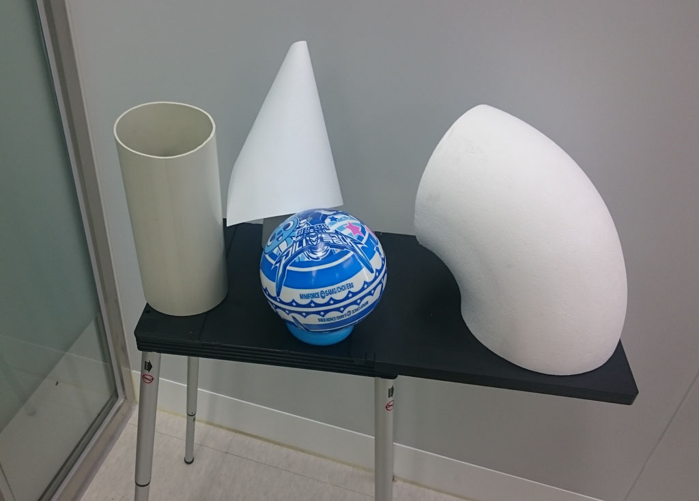
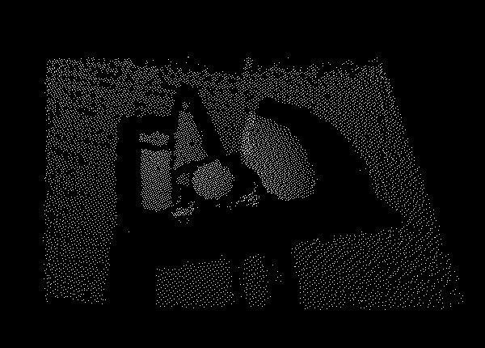

# FindSurface-Samples / BasicSample / Readme.md
**Curv*Surf* FindSurface™ SDK** Samples - BasicSample

> Note: The content in this repository has been deprecated. See [this page](https://github.com/CurvSurf/FindSurface) instead.

Overview
--------

This sample source code presents the simplest usage of FindSurface SDK.

The sample program reads sample.xyz file and automatically finds primitives around pre-defined positions. Without the sample.xyz file, it won't work at all, so make sure that you download the file [here](https://github.com/CurvSurf/FindSurface-Sample-BasicSample/releases).

**The sample only runs with our FindSurface SDK library files (FindSurface.dll, etc.).**

**You must either [request a free trial](http://developers.curvsurf.com/licenses.jsp) or [purchase a license](https://developers.curvsurf.com/licenses.jsp) to activate the library files.**

Quick Start
------------

### Before building the sample

Download FindSurface SDK library files at [our developer website](https://developers.curvsurf.com/downloads.jsp).

##### Windows: Visual Studio

Copy the lib directory in the zip file to BasicSample/vs14/libFindSurface. Or you may update the library path in the BasicSample.vcxproj file. 

##### Linux: Makefile

Open Makefile script and change **DUMMY_PATH** variable to your dummy library file path.

### Sample data used in this sample application

The sample point cloud data used in this simple FindSurface application is captured by the [Google Tango Tablet](https://developers.google.com/tango/hardware/tablet).  
The captured point cloud data is stored in **sample.xyz** file.
The scene of sample point cloud data looks like below:

|  |  |
| :--------------------------------------: | :--------------------------------------: |
|       **Figure 1. Captured Scene**       |        **Figure 2. Point Cloud**         |

### Getting Started to develop your own application

Our [developer website](https://developers.curvsurf.com/documentation.jsp) provides detailed instruction on how to develop by using FindSurface SDK.

CONTACT
-------

Send an email to support@curvsurf.com to contact our support team.
